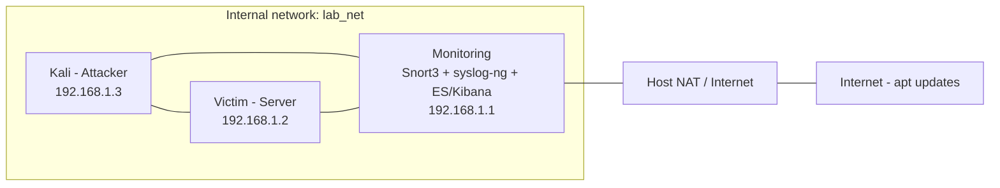
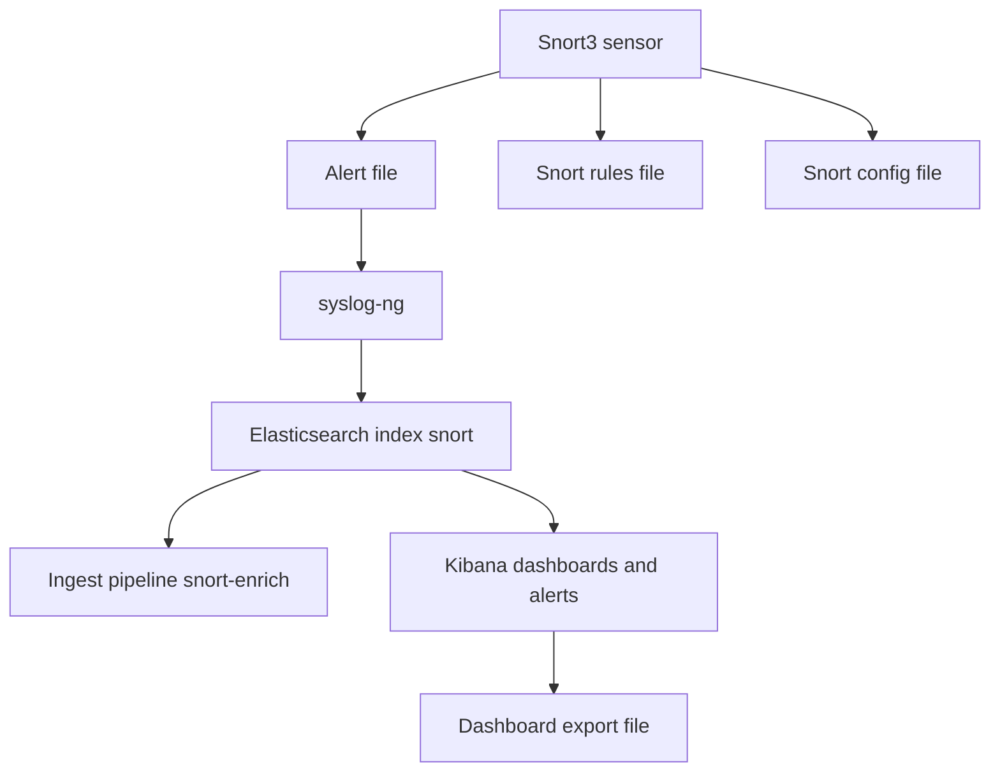

# Architecture du labo
Ce labo reproduit une architecture simplifiée d'un système de détection et d'agrégation de logs.  
Dans ce contexte pédagogique, toutes les machines sont sur le même réseau interne (`lab_net`) pour faciliter les tests, mais l'architecture simule le chemin réel des flux d'alerte :

**Résumé logique :**  
`Attacker (Kali)  <-->  monitoring (Snort3 + syslog-ng + Elasticsearch/Kibana)  <-->  Victim (Ubuntu, services)`

- **Topology réseau (pratique pour le labo)**  
  - `monitoring` : interface sur l'Internal Network `lab_net` (ex. 192.168.1.1/24) + seconde interface NAT/Host-only pour Internet/apt.  
  - `victim` et `attacker` : connectés au même `lab_net` (ex. 192.168.1.2 et 192.168.1.3).  
  - `monitoring` observe le trafic L2 du `lab_net` (via promisc mode ou en faisant office de routeur selon la topologie choisie).

- **But pédagogique** : simuler la détection d'attaques (HTTP exploit, portscan, brute SSH, DNS exfil, ICMP flood) et prouver la chaîne : détection → ingestion → visualisation/alerte.

## Diagramme réseau

## Diagramme : flux et interactions entre outils & fichiers de configuration

## Légende et fichiers importants
- **Alert file** → `/var/log/snort/alert_json.txt`
(Snort écrit une ligne JSON par événement — JSONL)
- **Snort rules file** → `/usr/local/etc/snort/rules/local.rules`
(règles personnalisées pour détecter les scénarios)
- **Snort config file** → /usr/local/etc/snort/snort.lua
(variables HOME_NET, outputs, include des rules, etc.)
- **ES ingest pipeline** → snort-enrich
(pipeline Elasticsearch qui convertit `seconds` → `@timestamp`, renomme `msg` → `rule_name`, découpe `rule` en gid/sid/rev, ajoute `event.module = snort`). Fichier repo : `configs/elastic/snort-enrich-pipeline.json`.
- **Kibana dashboard export** → `kibana/dashboards/*.ndjson`
(export NDJSON importable pour précharger dashboards / visualisations quand tu refais les tests)

## Remarques & limites
- Dans un déploiement réel, l'attaquant n'est généralement pas aussi « proche » du monitoring — ici la simplification aide la reproductibilité.
- Veille à synchroniser l'heure (ntp) sur toutes les VMs pour obtenir des timestamps cohérents dans Kibana.
- La topologie peut être modifiée : si la monitoring est configurée en routeur (2 internal nets), elle peut capturer tout le trafic sans promisc mode ; autrement utilise promisc on sur l'interface interne.

## Où insérer / vérifier ces composants dans le repo
- pipeline ES : configs/elastic/snort-enrich-pipeline.json
- Snort config & rules : configs/snort/snort.lua, configs/snort/local.rules
- export Kibana : kibana/dashboards/ (mettre le .ndjson exporté)
