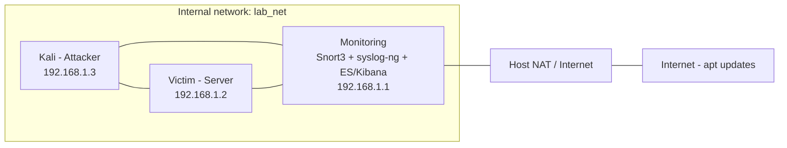
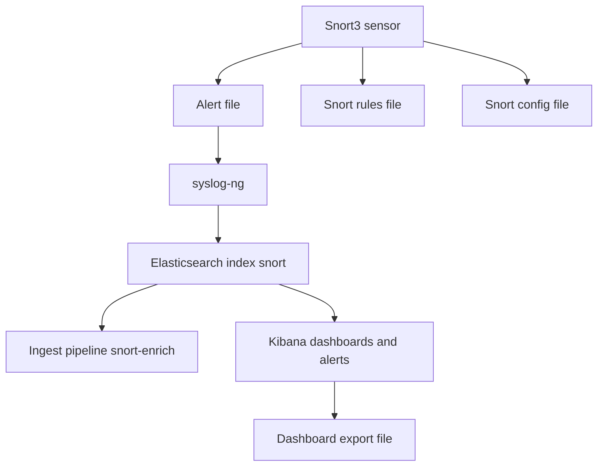

# Architecture du laboratoire
Ce document présente l'architecture logique du laboratoire et les interactions entre les composants.
Dans ce contexte pédagogique, toutes les machines sont sur le même réseau interne (`lab_net`) pour faciliter les tests, mais l'architecture simule le chemin réel des flux d'alerte :

## Vue d'ensemble
Attacker (Kali)  <-->  Monitoring (Snort3 + syslog-ng + Elasticsearch/Kibana)  <-->  Victim (Ubuntu, services)
- Le composant `monitoring` dispose d'une interface sur l'Internal Network `lab_net` et d'une interface NAT pour l'accès Internet.  
- Les machines `victim` et `attacker` sont connectées au même `lab_net` pour faciliter les tests de détection.
> Dans un déploiement réel, l'attaquant n'est généralement pas aussi « proche » du monitoring — ici la simplification aide la reproductibilité.

## Diagramme réseau

## Diagramme : flux et interactions entre outils & fichiers de configuration

## Fichiers importants
- `Alert file` → `/var/log/snort/alert_json.txt` (JSONL produit par Snort).  
- `Snort rules file` → `/usr/local/etc/snort/rules/local.rules`.  
- `Snort config file` → `/usr/local/etc/snort/snort.lua`.  
- `ES ingest pipeline` → `snort-enrich` (fichier du dépôt : `configs/elastic/snort-enrich-pipeline.json`).  
- `Kibana dashboard export` → `kibana/dashboards/*.ndjson`.
