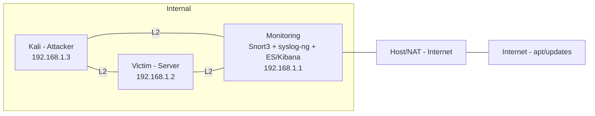

# Architecture du labo
Schéma logique :
Attacker (Kali) <--> monitoring (Snort3 + syslog-ng + ES/Kibana) <--> Victim (Ubuntu, services)
- monitoring possède deux interfaces internes (lab_att, lab_vic) plus une interface de management.
- Snort3 écrit des alertes JSON dans /var/log/snort/alert_json.txt
- syslog-ng lit ce fichier (no-parse) et POSTe chaque ligne vers Elasticsearch en utilisant le pipeline `snort-enrich`.
- Kibana lit l'index `snort` et expose dashboards + règles d'alerte.



```mermaid
graph TD
  Snort[Snort3 (sensor)]
  AlertsFile["/var/log/snort/alert_json.txt\n(JSONL)"]
  SyslogNg[syslog-ng]
  Elasticsearch[Elasticsearch\n(index: snort)]
  Kibana[Kibana\n(dashboards / alerts)]
  DashboardFile["kibana/dashboards/snort_dashboard.ndjson"]
  Rules["/usr/local/etc/snort/rules/local.rules"]
  SnortLua["/usr/local/etc/snort/snort.lua"]
  Pipeline["ES ingest pipeline\nsnort-enrich"]

  Snort -->|writes JSONL| AlertsFile
  AlertsFile -->|read & POST| SyslogNg
  SyslogNg -->|POST (pipeline snort-enrich)| Elasticsearch
  Elasticsearch -->|serves data| Kibana
  Kibana -->|export/import| DashboardFile
  Snort -->|reads rules| Rules
  Snort -->|reads config| SnortLua
  Elasticsearch -->|executes ingest| Pipeline
```
