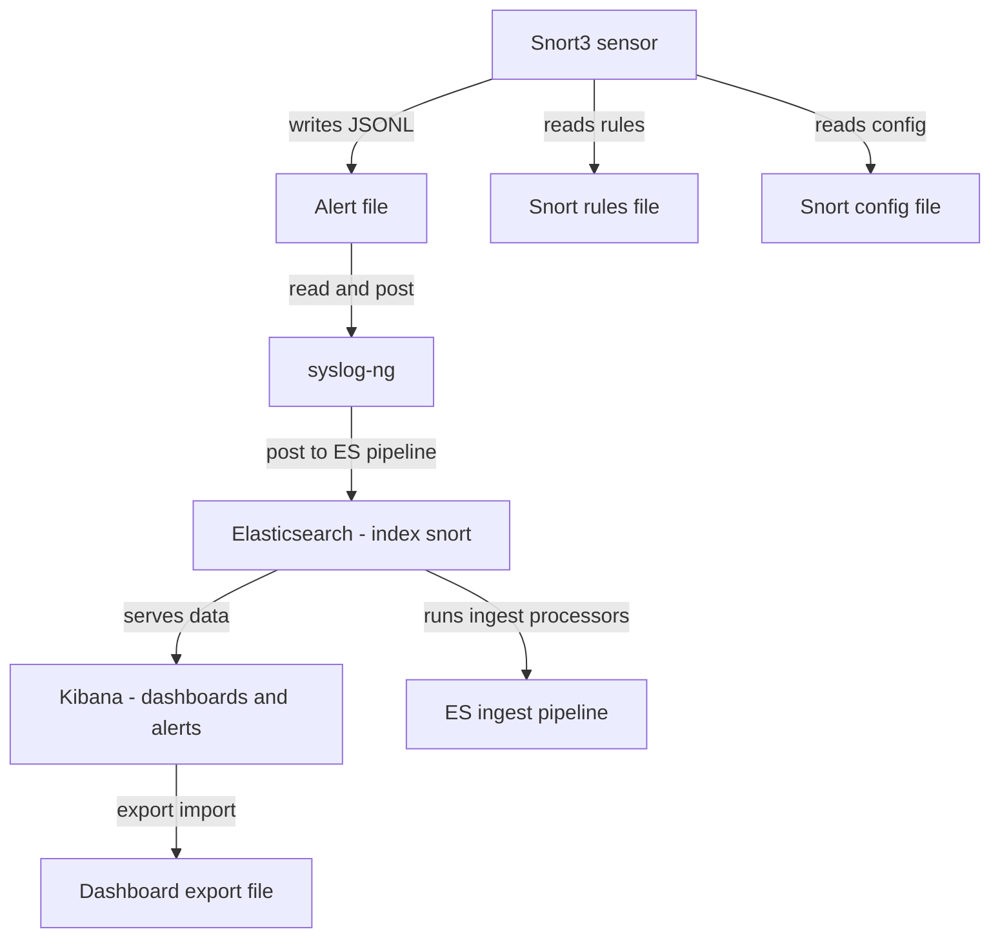

# Architecture du labo
Schéma logique :
Attacker (Kali) <--> monitoring (Snort3 + syslog-ng + ES/Kibana) <--> Victim (Ubuntu, services)
- monitoring possède deux interfaces internes (lab_att, lab_vic) plus une interface de management.
- Snort3 écrit des alertes JSON dans /var/log/snort/alert_json.txt
- syslog-ng lit ce fichier (no-parse) et POSTe chaque ligne vers Elasticsearch en utilisant le pipeline `snort-enrich`.
- Kibana lit l'index `snort` et expose dashboards + règles d'alerte.

