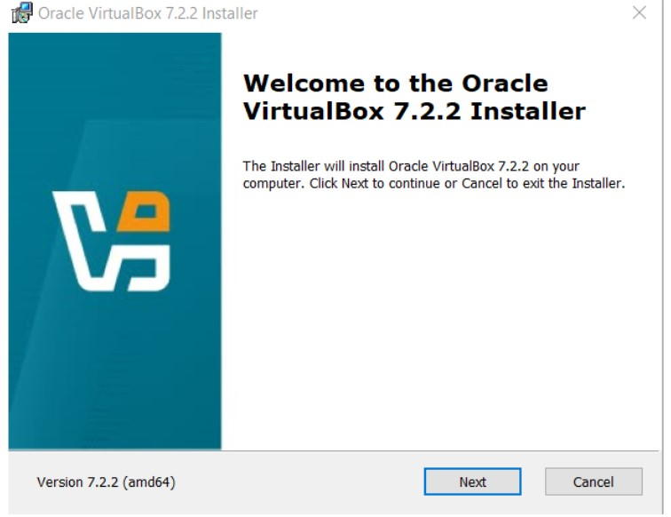
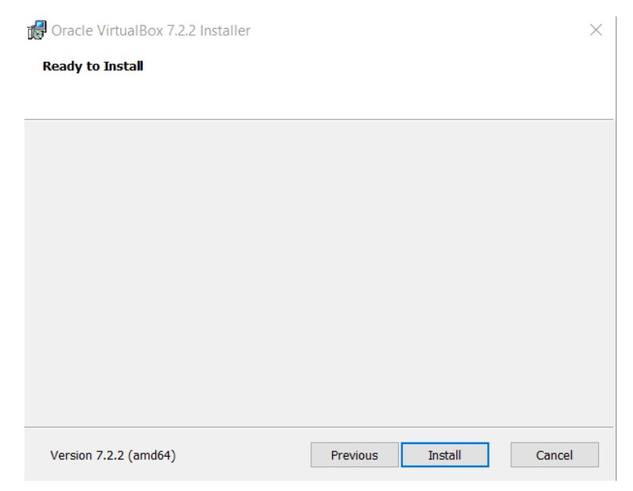

# Récupérer et configurer les VMs (VirtualBox)

## 1. Installer VirtualBox
Télécharger et installer VirtualBox depuis le site officiel :  
https://www.virtualbox.org/wiki/Downloads

Lancer l'exécutable de VirtualBox téléchargé, puis cliquez sur "Suivant".
<br>


<br>


<br>


<br>

Cliquez sur "Suivant" pour poursuivre.
Cliquez sur "oui".
Cliquez sur "installer".
## 2. Où récupérer des VMs (osboxes / Kali)
- **OSBoxes** (Ubuntu, autres distros préconfigurées) — pratique pour `monitoring` et `victim` :  
  https://www.osboxes.org/virtualbox-images/   
  *Mot de passe par défaut souvent indiqué sur la page de l’OVA (ex. "osboxes.org").*
  
> **Important** : Récupérer version `OVA`

- **Kali Linux (VM)** — distribution pour tests d’intrusion, idéal pour `attacker` :  
  https://www.kali.org/get-kali/#kali-virtual-machines

> **Important** : Prendre version `VirtualBox`

## 3. Importer les VM dans VirtualBox
1. Pour **monitoring** et **attacker** : VirtualBox → **Fichier → Importer un appareil virtuel…** → sélectionner l’OVA → **Suivant**.  
2. Pour **vicim** : cloner la VM **monitoring** (clic droit → **Cloner…**) → choisir **Clone complet** et **Réinitialiser les adresses MAC** pour éviter les conflits réseau. → Ainsi, pas la peine de télécharger une 3e OVA.
3. Renommer les VMs logiquement (ex. `victim-ubuntu`, `attacker-kali`, `monitoring-ubuntu`).

**Conseil** : prendre un snapshot après l’import et avant toute grosse modification (`Machine → Snapshots (Instantanés) → Prendre un instantané`).

## 4. Paramètres recommandés (ressources)
Ajuster selon les ressources de l'hôte :
- Monitoring (ELK + syslog-ng + Snort) : 4 vCPU, 8–12 GB RAM, 40–80 GB disque.  
- Victim (serveur web) : 2 vCPU, 2–4 GB RAM, 20 GB disque.  
- Attacker (Kali) : 2 vCPU, 4 GB RAM, 20 GB disque.

## 5. Réseau VirtualBox recommandé (topologie fiable)
Objectif : que la **monitoring** voie le trafic entre `attacker` et `victim`.

### Topologie simple (recommandée)
- Créer un **Internal Network** (ex. `lab_net`).
- **monitoring** :
  - Adapter 1 → *Internal Network* `lab_net`  (interface interne pour sniffing / monitoring)  
  - Adapter 2 → *NAT* pour accès Internet / `apt`  
  - **Activer Promiscuous Mode = Allow All** :
    - GUI : VirtualBox → Paramètres VM → Réseau → Avancé → *Promiscuous Mode*: **Allow All**
    - Dans la VM :  
      ```bash
      # remplacer <interface> par le nom de l'interface pour lab_net (voir ip a → **6. Nom d'interface et vérifications**)
      sudo ip link set dev <interface> promisc on
      ```
- **victim** :
  - Adapter 1 → *Internal Network* `lab_net`  
  - Adapter 2 → *NAT* (pour apt / Internet si nécessaire)
- **attacker** (Kali) :
  - Adapter 1 → *Internal Network* `lab_net`

> **Remarque** :  Activer le mode de promiscuité ne suffit pas pour que **monitoring** puisse lire le trafic, il faut également que **victim** et **attacker** indiquent **monitoring** en tant que passerelle par défaut. Voir **8. Exemples : config IP statique (persistant)**.

## 6. Nom d'interface et vérifications
Les noms d’interface peuvent varier (`eth0`, `enp0s3`, `ens33`, ...). Toujours vérifier avec :
```bash
ip a
```
> **Pour Monitoring** : Repèrer l’interface correspondant à l’Internal Network (ex. celle qui a l’IP 192.168.1.x). C’est sur celle-ci que tu activeras le promisc et où Snort écoutera.

## 7. IPs & exemples (valeurs utilisées pour les tests)
Exemple cohérent :
- **Monitoring** (interface interne) : `192.168.1.1/24`
- **Victim** (serveur web) : `192.168.1.2/24`
- **Attacker** (Kali) : `192.168.1.3/24`
> **A savoir** : L’interface NAT obtient une IP par VirtualBox ; les IP ci-dessus concernent l’Internal Network.

## 8. Exemples : config IP statique (persistant)
### Ubuntu (victim) — netplan
Fichier `/etc/netplan/01-lab.yaml` :
```yaml
network:
  version: 2
  renderer: networkd
  ethernets:
    enp0s3:
      addresses: [192.168.1.2/24]
      gateway4: 192.168.1.1
```
Appliquer :
```bash
sudo netplan apply
```

### Kali (attacker) — nmcli (NetworkManager)
- En interface graphique (plus facile) faire: clic droit sur l'onglet réseau en haut à gauche-edit connections-wired connection 1-clic sur la roue dentelée en bas-ipv4 settings-renseigner adresse ip, netmask et gateway
ou encore en passant par l'invite de commande
```bash
# adapter ifname=eth0 si différent
nmcli con add type ethernet ifname eth0 con-name lab_net \
  ipv4.addresses 192.168.1.3/24 ipv4.gateway 192.168.1.1 \
  ipv4.method manual
nmcli con up lab_att
```

### Méthode temporaire (tous OS)
```bash
sudo ip addr add 192.168.1.3/24 dev <iface>
sudo ip link set dev <iface> up
sudo ip route add default via 192.168.1.1
```
(Cela n’est pas persistant au reboot.)

## 9. Activer la capture / test promisc & sniff

Pour vérifier que la monitoring voit le trafic :
1. Sur la monitoring VM, trouve l’interface :
```bash
ip a
```
2. Activer le mode promisc (si pas déjà fait via GUI) :
```bash
sudo ip link set dev <interface> promisc on
```
3. Lancer une capture `tcpdump` :
```bash
sudo tcpdump -n -i <interface> host 192.168.1.3 and host 192.168.1.2
```
4. Depuis attacker (Kali) :
```bash
curl -v --noproxy "*" http://192.168.1.2/
```
Si SYN / GET / 200 dans `tcpdump` sur la monitoring → sniff OK.

## 10. NAT / accès Internet et apt
- Le second adaptateur en NAT permet aux VMs d’accéder à Internet pour `apt` sans exposer le réseau interne.
- Pour installer `Apache` sur la victim (étape nécessaire pour tester les scénarios finaux) :
```bash
sudo apt update && sudo apt install -y apache2
sudo systemctl status apache2 # doit être actif
```

## 11. Copier/Coller bidirectionnel & Guest Additions
1. Arrêter la VM.
2. **VirtualBox Manager → VM → Paramètres → Général → Avancé → Presse-papiers partagé** : *Bidirectionnel*.
3. Démarrer la VM → **VirtualBox → Périphériques → Insérer l’image CD des Additions invité...**
4. Dans la VM (Debian/Ubuntu) :
```bash
sudo apt update
sudo apt install -y build-essential dkms linux-headers-$(uname -r)
sudo sh /media/cdrom/VBoxLinuxAdditions.run
sudo reboot
```
5. Vérifier le copier/coller entre hôte ↔ VM.

## 12. Remarques
- Les noms d'interface (ex : `enp0s3`, `eth0`) varient selon les distributions ; utiliser `ip a` pour identifier l'interface interne.  
- Prendre des snapshots avant toute modification majeure.  
- Synchroniser l'heure (`sudo timedatectl set-ntp true`) sur toutes les VMs pour garantir la cohérence des timestamps.
